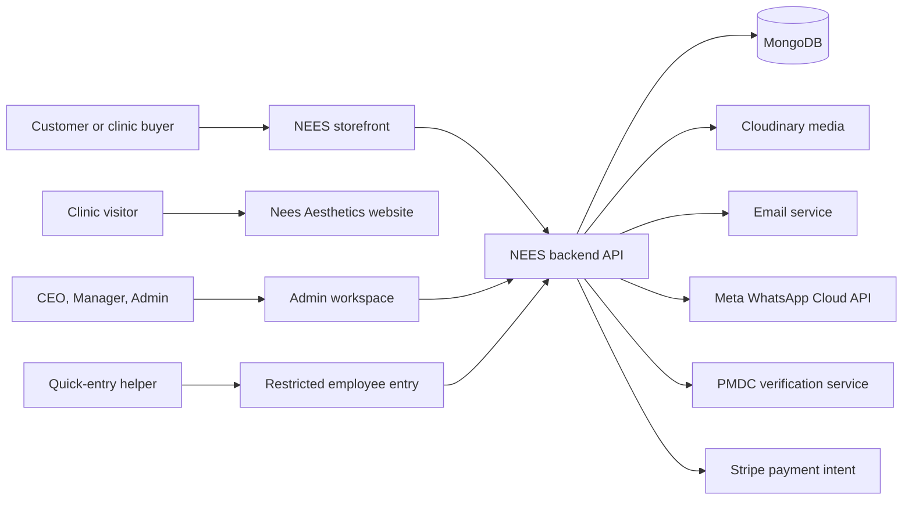

# 1. Platform Overview

## 1.1 What the NEES Medical Group platform is

The platform supports three connected business experiences:

1. **NEES Medical commerce and professional supply** — customers can discover skincare products, clinical products, aesthetic devices, accessories, educational content, offers, and training events.
2. **Nees Aesthetics clinic presence** — patients can understand the Lahore clinic, services, consultation approach, location, and contact options.
3. **Internal operations** — authorized staff manage catalog data, orders, payment evidence, events, employees, offices, company assets, communications, and protected records.

The platform is not one application. It is a group of separately deployed applications that share the backend and business data.

## 1.2 Application map

| Application | Local path | Technology | Main audience | Primary responsibility |
| --- | --- | --- | --- | --- |
| NEES storefront | `frontend` | Next.js 13, React, Redux Toolkit | Customers, clinic buyers, search visitors | Retail shopping, professional discovery, checkout, accounts, content, events, SEO |
| Admin workspace | `Admin_Dashboard/frontend/M3` | React 18, Vite, React Router | CEO, managers, administrators, restricted guests | Business operations and internal records |
| Backend API | `Backend_ok` | Node.js, Express, Mongoose | All NEES applications | Authentication, validation, data storage, media, email, payment/order operations, PMDC and WhatsApp integrations |
| Clinic website | `CLININC_FRONTEND` | Next.js 16, React 19 | Patients and clinic visitors | Nees Aesthetics marketing, service education, location, contact |
| Reference backend | `Backend_ok_main` | Node.js, Express | Developers | Older/reference implementation and supporting tests; not the primary active API |

## 1.3 High-level architecture

The clinic website is primarily a standalone marketing site. The storefront and admin workspace rely heavily on the shared backend.

## 1.4 Core business domains

### Commerce

- Retail products, brands, and categories.
- Cart, wishlist, comparison, checkout, coupons, and order tracking.
- Orders from authenticated users and guest customers.
- Status management, dispatch data, payment verification, and audit history.
- Customer and staff notifications through email and optionally WhatsApp.

### Professional and clinical supply

- Clinic-use products and aesthetic supplies.
- Medical/aesthetic machines and devices.
- Accessories and add-ons.
- Inquiry-first pages for products that should not use ordinary checkout.
- Request pricing, proposal, quote, demo, and sales-contact journeys.

### Content and demand generation

- SEO landing pages for product families and Pakistani search terms.
- Blog publishing with workflow and metadata.
- Structured data, canonical URLs, sitemap generation, and robots controls.
- Training event discovery and registration.

### Clinic marketing

- Nees Aesthetics service categories.
- Consultation-first patient journey.
- About, service, contact, location, hours, phone, email, and WhatsApp.

### Internal operations

- Dashboard metrics and operational navigation.
- Catalog and media management.
- Order fulfillment and financial verification.
- Staff accounts and role-aware pages.
- People, offices, assets, custody, transfers, and maintenance.
- Protected deletions and restricted guest employee entry.
- WhatsApp campaigns to opted-in customers.

## 1.5 End-to-end business flow

### Customer purchase flow

1. A visitor finds a product through navigation, search, a keyword page, a blog, or a campaign.
2. The storefront retrieves current catalog data from the backend.
3. The visitor adds products to cart and proceeds through checkout.
4. Coupon eligibility and order totals are checked by backend logic.
5. The backend stores an order snapshot and sends configured notifications.
6. Staff review the order in the admin workspace.
7. Staff move the order through pending, processing, dispatched, delivered, or cancelled states.
8. Dispatch updates may send customer email with courier or local-delivery details.
9. CEO/Manager users verify received payment and attach proof where required.

### Professional inquiry flow

1. A clinic buyer finds a professional product, machine, or accessory.
2. The page shows professional-use guidance and inquiry-oriented actions.
3. The visitor moves to a quote, pricing, proposal, demo, sales, contact, or WhatsApp action.
4. The commercial team follows up outside ordinary retail checkout where appropriate.

### Employee and asset flow

1. An office is created and receives a unique code.
2. An employee draft is created by a Manager/CEO or a restricted Guest helper.
3. A Manager/CEO reviews the record, completes CEO-level fields, and activates the employee when requirements are satisfied.
4. Company assets are registered to an office.
5. An available asset may be assigned to an active employee in the same operational registry.
6. Assignment, return, and office-transfer history preserve custody information.
7. Issues, maintenance, accidents, fines, claims, and costs are recorded against the asset.

### Training event flow

1. Staff create and publish an event with its registration rules.
2. The storefront lists the event and accepts a registration while registration is enabled.
3. Doctor identity data may be checked against PMDC.
4. Admin users review, retry verification, approve, reject, export, or delete registrations.
5. Configured email/WhatsApp services can notify the registrant.

## 1.6 Primary sources of truth

| Business data | Source of truth |
| --- | --- |
| Products | Backend `Products` collection |
| Accessories | Backend `Accessories` collection |
| Machines/devices | Backend `Machines` collection |
| Categories and brands | Backend `Categories` and `Brands` collections |
| Orders | Current `OrderNew` plus legacy `Order` collections |
| Blogs | Backend `BlogPost` plus a small amount of legacy/static frontend content |
| Training events | Backend `TrainingEvent` and `TrainingEventRegistration` collections |
| Staff/admin accounts | Backend `Admin` collection |
| Customer accounts | Backend `User` collection |
| Offices | Backend `Office` collection |
| Employees | Backend `Employee` collection |
| Company assets | Backend `CompanyAsset` collection |
| Asset issues | Backend `AssetIssue` collection |
| Security PIN hashes | Backend `SecuritySetting` collection |
| Protected map links | Backend `GoogleMapLink` collection |
| Images and private documents | Cloudinary, with references stored in MongoDB |

## 1.7 Platform design principles

- Public pages optimize for discovery, trust, conversion, and clear medical/professional positioning.
- Internal pages optimize for traceability, role separation, and operational speed.
- Sensitive identity, financial, and company-property data must never be exposed through public routes.
- External services are treated as optional dependencies; email, WhatsApp, PMDC, Stripe, and Cloudinary need correct environment configuration.
- Legacy endpoint and data compatibility is intentionally retained in several modules while the platform evolves.
- Destructive actions require stronger authority than ordinary editing.
